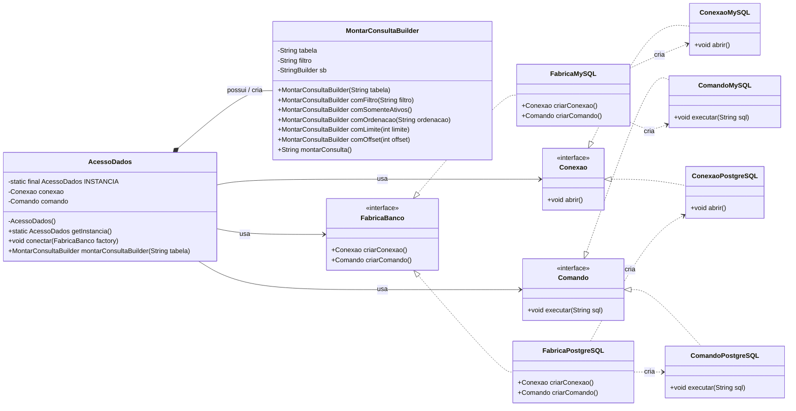

```mermaid

classDiagram
    direction LR

    class AcessoDados {
        -static final AcessoDados INSTANCIA
        -Conexao conexao
        -Comando comando
        -AcessoDados()
        +static AcessoDados getInstancia()
        +void conectar(FabricaBanco factory)
        +MontarConsultaBuilder montarConsultaBuilder(String tabela)
    }

    class MontarConsultaBuilder {
        -String tabela
        -String filtro
        -StringBuilder sb
        +MontarConsultaBuilder(String tabela)
        +MontarConsultaBuilder comFiltro(String filtro)
        +MontarConsultaBuilder comSomenteAtivos()
        +MontarConsultaBuilder comOrdenacao(String ordenacao)
        +MontarConsultaBuilder comLimite(int limite)
        +MontarConsultaBuilder comOffset(int offset)
        +String montarConsulta()
    }

    class FabricaBanco {
        <<interface>>
        +Conexao criarConexao()
        +Comando criarComando()
    }

    class FabricaMySQL {
        +Conexao criarConexao()
        +Comando criarComando()
    }

    class FabricaPostgreSQL {
        +Conexao criarConexao()
        +Comando criarComando()
    }

    class Conexao {
        <<interface>>
        +void abrir()
    }

    class Comando {
        <<interface>>
        +void executar(String sql)
    }

    class ConexaoMySQL {
        +void abrir()
    }

    class ComandoMySQL {
        +void executar(String sql)
    }

    class ConexaoPostgreSQL {
        +void abrir()
    }

    class ComandoPostgreSQL {
        +void executar(String sql)
    }

    AcessoDados *-- MontarConsultaBuilder : possui / cria
    FabricaBanco <|.. FabricaMySQL
    FabricaBanco <|.. FabricaPostgreSQL
    Conexao <|.. ConexaoMySQL
    Conexao <|.. ConexaoPostgreSQL
    Comando <|.. ComandoMySQL
    Comando <|.. ComandoPostgreSQL
    
    FabricaMySQL ..> ConexaoMySQL : cria
    FabricaMySQL ..> ComandoMySQL : cria
    FabricaPostgreSQL ..> ConexaoPostgreSQL : cria
    FabricaPostgreSQL ..> ComandoPostgreSQL : cria
    
    AcessoDados --> FabricaBanco : usa
    AcessoDados --> Conexao : usa
    AcessoDados --> Comando : usa
```